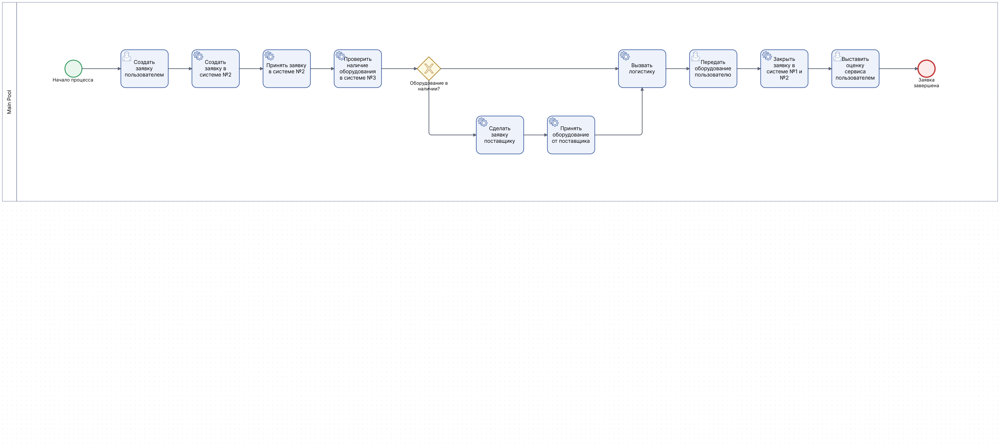

# Техническое задание (БА+СА) аналитик


# Решение задачи: Моделирование процесса выдачи ИТ-оборудования

Данный репозиторий содержит описание и BPMN 2.0 модель рабочего процесса выдачи оборудования в компании «X».

## 📋 Описание процесса
Процесс охватывает путь заявки от обращения пользователя до получения оборудования и оценки сервиса. Включает взаимодействие ИТ-поддержки, отдела снабжения, логистики и внешних поставщиков.

### Ключевые участники:
*   **Пользователь** — инициатор заявки.
*   **1-я линия ТП** — регистрация и выдача.
*   **Отдел снабжения** — проверка склада и закупка.
*   **Логистика** — доставка внутри компании.
*   **Поставщик** — внешняя поставка оборудования.

---

## 🛠 Технологический стек
*   **Нотация:** BPMN 2.0
*   **Формат файла:** `.bpmn` (XML)
*   **Инструменты:** GitHub, Mermaid

---

## 📊 Схема процесса (Mermaid)
> [!TIP] 
> Если схема ниже не отображается, убедитесь, что вы просматриваете README в интерфейсе GitHub.

```mermaid
graph TD
    Start((Начало)) --> Request[Заявка по почте/тел]
    Request --> Reg[Регистрация в Системе 1 и 2]
    Reg --> Check{Наличие в Системе 3}
    
    Check -- Есть --> Log[Вызов логистики]
    Check -- Нет --> Purchase[Заказ у поставщика]
    
    Purchase --> Receive[Приемка в Системе 3]
    Receive --> Log
    
    Log --> Delivery[Передача в ТП]
    Delivery --> Close[Выдача и закрытие заявок]
    Close --> Feedback[Оценка сервиса]
    Feedback --> End((Конец))

    style Start fill:#f9f,stroke:#333
    style End fill:#f9f,stroke:#333
    style Check fill:#fff4dd,stroke:#d4a017


