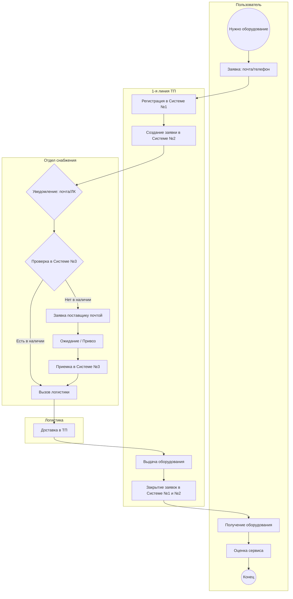

# Техническое задание (БА+СА) аналитик
---

## Задача 1
---
Сделайте модель в нотации BPMN 2.0 по описанию рабочего потока ниже. 

### Описание:

В компании «X» работает выдача ит-оборудования пользователям по заявке, которую надо оформлять в системе №1. Пользователь офиса, когда ему нужно, делает заявку через почту или по телефону в 1-ую линию технической поддержки на оборудование. Он получает номер обращения, благодаря которому может отследить, что происходит с его заявкой. Первая линия технической поддержки делает заявку на оборудование (на основании заявки от пользователя) в системе №2  отделу снабжения. Отдел снабжения принимает заявку в системе №2. Отдел снабжения видит, что есть заявка на оборудование по уведомлению из почты и также - на экране своего личного кабинета системы №2. Далее отдел снабжения проверяет наличие запрашиваемого пользователем оборудования в системе №3. 
Если оборудование есть - снабжение вызывает логистику и отправляет оборудование первой линии технической поддержки. Техническая поддержка выдаёт это оборудование пользователю и закрывает заявку пользователя в системе №1 и закрывает заявку в системе №2. Пользователь получает оборудование и может выставить оценку сервиса технической поддержке. 
Если оборудования нет - снабжение делает заявку на закупку поставщику через почту. Ждёт оборудование. Поставщик его привозит. Далее снабжение проводит приём оборудования у себя в системе №3. Далее вызывает логистику и передаёт оборудование технической поддержке. Техническая поддержка выдаёт это оборудование пользователю и закрывает заявку пользователя в системе №1 и закрывает заявку в системе №2. Пользователь получает оборудование и может выставить оценку сервиса технической поддержке.
На модели можно указать вопросы, противоречия к описанию рабочего потока. (Чего не хватает для грамотного отражения модели «как есть”) 


## Решение задачи: Моделирование процесса выдачи ИТ-оборудования

Я провел анализ ТЗ и выявил ряд слабых мест и противоречий. Догадываюсь, что данное ТЗ создано специально немного "криво", дабы понять уровень компетенций тестируемого. Исходя из этого я сделал два варианта решения данной задачи: одно "как есть", второе - с учетом моих поправок в ТЗ. Итак, ниже первый вариант решения.

## Решение задачи, вариант-1: Процесс выдачи ИТ-оборудования (BPMN 2.0)

Ниже представлена логика процесса, визуализированная с помощью Mermaid. Она в точности повторяет шаги, описанные в техническом задании.


## Решение задачи, вариант 2:

### Итак, в данном ТЗ я нашел ряд проблемных мест, опишем их подробнее:

1. Информационный разрыв: В ТЗ пропущен пункт о том, КАК  Система №1 узнает о ходе дела в Системе №2 и №3. User видит номер, но при этом  статус может не меняться.
2. Дублирование каналов: Снабжение получает одно и тоже уведомление и по почте, и в ЛК. Это создает риск двойной обработки.
3. Ручное закрытие: ТП вынуждена закрывать заявки вручную в двух разных системах (№1 и №2), что ведет к ошибкам и потере времени.
4. Неопределенность логистики: Фраза "вызывает логистику" не описывает, как конкретно передается информация (заявка, звонок, документ?).

### Вносим ключевые улучшения:

1. Единое окно: ТП работает в одной системе, данные в другие системы передаются через API.
2. Прозрачность: Статусы "Закупка" или "Перемещение" автоматически транслируются пользователю в Систему №1.
3. Минимизация почты: Переход от почтовых уведомлений к системным Task-листам.
4. Контроль: Оценка сервиса становится обязательным шагом для закрытия KPI техподдержки.

### Далее модель с учетом улучшений:

graph TD
    A((Старт)) --> B[Регистрация обращения в Системе №1]
    B --> C{Авто-интеграция с Системой №2}
    C --> D[Снабжение: Проверка остатков в ERP/Системе №3]
    
    D -->|Отсутствует| E[Авто-заказ поставщику]
    E --> F[Приемка по штрих-коду]
    F --> G
    
    D -->|В наличии| G[Формирование задания на перемещение]
    G --> H[Логистика: Доставка с подтверждением в системе]
    H --> I[ТП: Выдача и закрытие одной кнопкой]
    I --> J[Авто-закрытие всех связанных тикетов]
    J --> K[Триггер оценки качества для пользователя]
    K --> L((Финиш))
```


