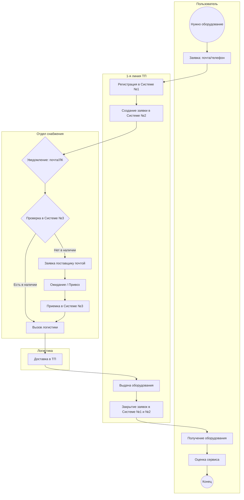
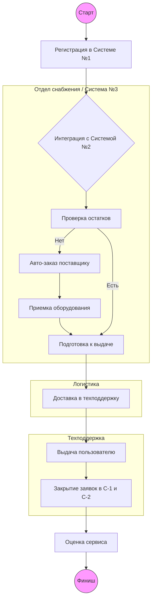
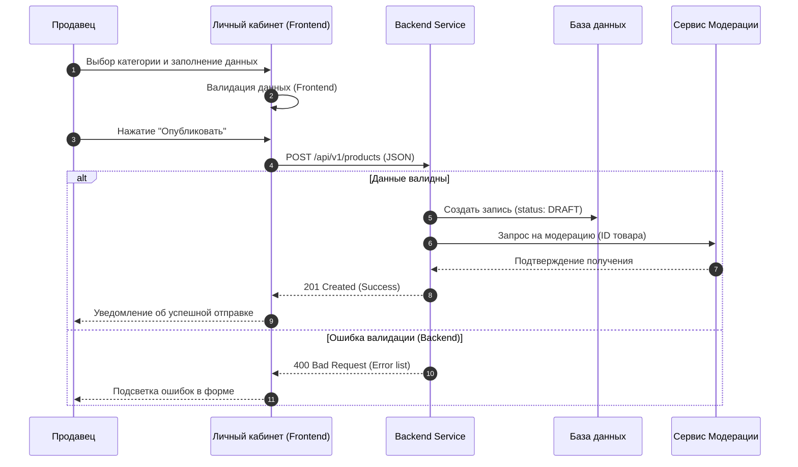

# Техническое задание (БА+СА) аналитик
---
### Выполнил: Сергей Малов
### saalevan@yandex.ru  Telegram: @sergeym18
---
## Задача 1
---
Сделайте модель в нотации BPMN 2.0 по описанию рабочего потока ниже. 

### Описание:

В компании «X» работает выдача ит-оборудования пользователям по заявке, которую надо оформлять в системе №1. Пользователь офиса, когда ему нужно, делает заявку через почту или по телефону в 1-ую линию технической поддержки на оборудование. Он получает номер обращения, благодаря которому может отследить, что происходит с его заявкой. Первая линия технической поддержки делает заявку на оборудование (на основании заявки от пользователя) в системе №2  отделу снабжения. Отдел снабжения принимает заявку в системе №2. Отдел снабжения видит, что есть заявка на оборудование по уведомлению из почты и также - на экране своего личного кабинета системы №2. Далее отдел снабжения проверяет наличие запрашиваемого пользователем оборудования в системе №3. 
Если оборудование есть - снабжение вызывает логистику и отправляет оборудование первой линии технической поддержки. Техническая поддержка выдаёт это оборудование пользователю и закрывает заявку пользователя в системе №1 и закрывает заявку в системе №2. Пользователь получает оборудование и может выставить оценку сервиса технической поддержке. 
Если оборудования нет - снабжение делает заявку на закупку поставщику через почту. Ждёт оборудование. Поставщик его привозит. Далее снабжение проводит приём оборудования у себя в системе №3. Далее вызывает логистику и передаёт оборудование технической поддержке. Техническая поддержка выдаёт это оборудование пользователю и закрывает заявку пользователя в системе №1 и закрывает заявку в системе №2. Пользователь получает оборудование и может выставить оценку сервиса технической поддержке.
На модели можно указать вопросы, противоречия к описанию рабочего потока. (Чего не хватает для грамотного отражения модели «как есть”) 


## Решение задачи: Моделирование процесса выдачи ИТ-оборудования

Я провел анализ ТЗ и выявил ряд слабых мест и противоречий. Догадываюсь, что данное ТЗ создано специально немного "криво", дабы понять уровень компетенций тестируемого. Исходя из этого я сделал два варианта решения данной задачи: одно "как есть", второе - с учетом моих поправок в ТЗ. Итак, ниже первый вариант решения.

## Решение задачи, вариант-1: Процесс выдачи ИТ-оборудования (BPMN 2.0)


## Решение задачи, вариант 2:

### Итак, в данном ТЗ я нашел ряд проблемных мест, опишем их подробнее:

1. Информационный разрыв: В ТЗ пропущен пункт о том, КАК  Система №1 узнает о ходе дела в Системе №2 и №3. User видит номер, но при этом  статус может не меняться.
2. Дублирование каналов: Снабжение получает одно и тоже уведомление и по почте, и в ЛК. Это создает риск двойной обработки.
3. Ручное закрытие: ТП вынуждена закрывать заявки вручную в двух разных системах (№1 и №2), что ведет к ошибкам и потере времени.
4. Неопределенность логистики: Фраза "вызывает логистику" не описывает, как конкретно передается информация (заявка, звонок, документ?).

### Вносим ключевые улучшения:

1. Единое окно: ТП работает в одной системе, данные в другие системы передаются через API.
2. Прозрачность: Статусы "Закупка" или "Перемещение" автоматически транслируются пользователю в Систему №1.
3. Минимизация почты: Переход от почтовых уведомлений к системным Task-листам.
4. Контроль: Оценка сервиса становится обязательным шагом для закрытия KPI техподдержки.

### Далее модель с учетом улучшений:



---

## Задача 2

### Описание:

Представьте, что вы аналитик Личного кабинета продавца.
Вам поступила задача сформулировать требования для реализации новой фичи (функциональности), которая позволит опубликовать свой товар на маркетплейсе (витрине товаров).

### Перед тобой следующие задачи:
 
 - Сделать верхнеуровневую постановку в формате User story и описать требования к новой функциональности в формате вариантов использования (Use Case).
 - Опционально: нарисовать диаграмму процесса в удобной нотации.

---

### Решение задачи:

Ниже представлена постановка задачи на реализацию фичи «Публикация товара на витрину» в Личном кабинете (ЛК) продавца.

### 1. User Story
**Как** Продавец маркетплейса,  
**Я хочу** иметь возможность самостоятельно создавать и редактировать карточки товаров через интерфейс ЛК,  
**Чтобы** мой ассортимент стал доступен покупателям на витрине и я мог начать продажи.

**Acceptance Criteria (Критерии приемки):**
* Форма создания содержит обязательные поля: Наименование, Категория, Описание, Цена, Габариты.
* Реализована возможность загрузки не менее 5 изображений (Drag-and-drop).
* Набор характеристик товара (размер, материал, мощность и т.д.) меняется динамически в зависимости от выбранной категории.
* После успешной отправки товар переходит в статус «На модерации».

---

### 2. Use Case (Вариант использования)

**Название:** Публикация нового товара через ЛК.  
**Актор:** Продавец.  
**Предусловие:** Продавец авторизован, магазин прошел верификацию.

### Основной поток (Happy Path):
1. Продавец переходит в раздел «Товары» и нажимает «Добавить товар».
2. Система открывает пустую форму.
3. Продавец выбирает категорию из справочника.
4. Система подгружает соответствующие категории атрибуты.
5. Продавец заполняет данные, устанавливает цену и загружает фото.
6. Продавец нажимает кнопку «Опубликовать».
7. Система проверяет заполнение обязательных полей и формат данных.
8. Система сохраняет карточку в БД со статусом `Pending` (На модерации).
9. Система выводит сообщение: «Товар успешно отправлен на проверку».

### Альтернативные потоки:
* **А1: Ошибка валидации.** Если поле «Цена» заполнено некорректно (например, 0 или отрицательное число), система подсвечивает поле красным и блокирует кнопку «Опубликовать».
* **А2: Превышение лимита фото.** Если загружаемое фото весит > 5Мб, система выводит предупреждение и сбрасывает загрузку файла.

---

### 3. Диаграмма процесса (Sequence Diagram)


---
## Задача №3

### На картинке (скачать можно по ссылке - https://drive.google.com/file/d/1fi9JLRvO6bhS1uJJ2PUX8ZTOq0Eq_At0/view?usp=drive_link) изображен интерфейс регистрации Пользователя (как успешный экран создания Пользователя, так и варианты с ошибками).

---
 Задание 3.1:
 Требуется описать REST api интерфейс на стороне бэк сервиса, который должен вызываться фронтендом при нажатии на кнопку “Register”. Описание должно включать:
http метод + URL
входные параметры (наименование, тип, обязательность, ограничения)
выходные параметры при успешном ответе (наименование, тип, обязательность, ограничения)
выходные параметры при ответе с ошибкой  (наименование, тип, обязательность, ограничения)
описание ошибок - коды ответов (главное верно указать клиентские или серверные) + текст сообщения
пример запроса
пример ответа (для успешного сценария и сценария с ошибкой).
Требований к формату нет (может быть в виде таблицы или просто текстом).
Допускается описание в формате openAPI спецификации. Полученный yaml  приложить в виде текста к решению или в виде отдельного файла (обязательно не забыть открыть доступ).
---
Задание 3.2
Описать подробный пошаговый алгоритм, создания Пользователя на стороне бэк сервиса при вызове, получившегося в Задачи 3.1 метода. Алгоритм должен подробно описывать какие проверки требуется выполнять  бэк сервису после получения запроса на создание нового Пользователя (при нажатии кнопки “Register”),  прежде чем создать Пользователя в БД. Описание может быть в виде текста или диаграммы (например, activity)/блок-схемы.
---

### Решение:

### 3.1 Описание REST API

Метод: POST
URL: /api/v1/users/register
Входные параметры (Request Body - JSON):
Наименование	Тип	Обяз.	Ограничения
firstName	String	Да	2-50 символов
lastName	String	Да	2-50 символов
username	String	Да	3-20 символов, уникальный, без пробелов
password	String	Да	Мин. 8 симв., наличие цифр и спецсимволов

Выходные параметры (Success 201 Created):
Наименование	Тип	Обяз.	Описание
id	UUID	Да	Уникальный идентификатор пользователя
status	String	Да	Статус создания (e.g., "created")

Коды ответов и описание ошибок:
Код	Текст ошибки (message)	Причина
400	VALIDATION_ERROR	Неверный формат данных (пустые поля, короткий пароль)
409	USERNAME_TAKEN	Пользователь с таким Username уже существует
500	INTERNAL_SERVER_ERROR	Критическая ошибка на стороне сервера

### Примеры запроса:

{
  "firstName": "Ivan",
  "lastName": "Ivanov",
  "username": "vanya_pro",
  "password": "SafePassword123!"
}

### Пример успешного ответа:

{
  "id": "550e8400-e29b-41d4-a716-446655440000",
  "status": "created"
}

### 3.2 Алгоритм работы бэкенд-сервиса (Activity Diagram)

После нажатия кнопки "Register", сервис выполняет следующие проверки:
1. Валидация схемы данных: Проверка, что все 4 поля присутствуют в JSON и не являются пустыми строками.
   
2. Длина и символы:
2.1. firstName/lastName — отсутствие цифр и спецсимволов.
2.2. username — проверка на допустимые символы (латиница, цифры, подчеркивания).
   
3. Проверка уникальности (Database Check): Поиск в базе данных записи с таким же username. Если найден — возврат ошибки 409.
   
4. Безопасность: Генерация соли (salt) и создание хеша пароля.
   
5. Транзакция в БД: Создание новой записи в таблице пользователей.
   
6. Ответ: Возврат ID созданного пользователя на фронтенд для перенаправления на экран успеха.

   ```mermaid
   graph TD
    A[Кнопка Register] --> B{Поля заполнены?}
    B -- Нет --> C[Ошибка 400: Empty fields]
    B -- Да --> D{Username свободен?}
    D -- Нет --> E[Ошибка 409: Username taken]
    D -- Да --> F{Пароль надежен?}
    F -- Нет --> G[Ошибка 400: Weak password]
    F -- Да --> H[Хеширование пароля]
    H --> I[Запись в DB]
    I --> J[201 Успех: Переход на Success Screen]
   ```
   

